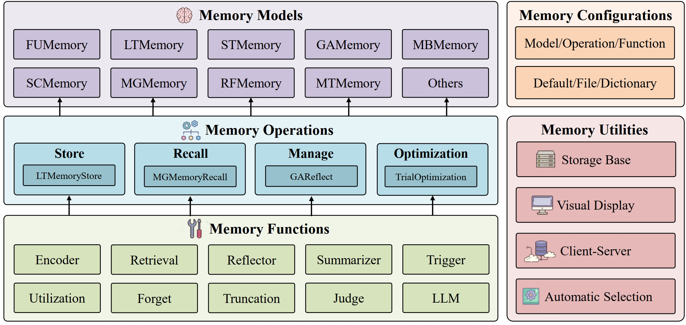

Overview
===============

The framework of our library is present in the following figure.

- The lowest level comprises memory functions, implementing basic functions (e.g., retrieval) as foundational supports for different memory operations.
- The intermediate level encompasses memory operations, constituting basic operations (e.g., memory recall) to construct different memory models.
- The highest level involves memory models, implementing various existing research models (e.g., MemoryBank) that can be conveniently applied in different agents.
- We provide a configuration module for easy modification of hyper-parameters and prompts at different levels.
- We also implement a utility module to conveniently save and demonstrate memory contents.

