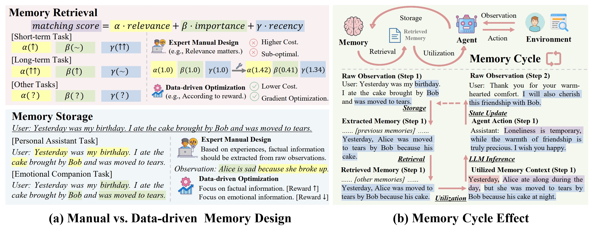

# Learn to Memorize: Optimizing LLM-based Agents with Adaptive Memory Framework

## 📝 Introduction

LLM-based agents have been extensively applied across various domains, where memory stands out as one of their most essential capabilities. Previous memory mechanisms of LLM-based agents are manually predefined by human experts, leading to higher labor costs and suboptimal performance. In addition, these methods overlook the memory cycle effect in interactive scenarios, which is critical to optimizing LLM-based agents for specific environments. To address these challenges, in this paper, we propose to optimize LLM-based agents with an adaptive and data-driven memory framework by modeling memory cycles. Specifically, we design an MoE gate function to facilitate memory retrieval, propose a learnable aggregation process to improve memory utilization, and develop task-specific reflection to adapt memory storage. Our memory framework empowers LLM-based agents to learn how to memorize information effectively in specific environments, with both off-policy and on-policy optimization. In order to evaluate the effectiveness of our proposed methods, we conduct comprehensive experiments across multiple aspects.

## 📌 Major Contributions


- We propose an adaptive and data-driven memory framework that empowers LLM-based agents to learn to memorize, with optimizable memory retrieval, utilization, and storage procedures.
- We formulate the memory cycle effect during agent-environment interactions, and propose off-policy and on-policy optimization strategies for our memory framework.
- We conduct comprehensive experiments to demonstrate the effectiveness of our framework in improving the performance of LLM-based agents when interacting with environments.

## 🚀 Run Experiments

### 💻1 Prepare for the environment.

Create an environment.

```shell
conda create -n ltm_env python=3.10.10
```

Activate the environment.

```shell
conda activate ltm_env
```

Install the packages.

```shell
cd experiments
pip install -r requirements.txt
```

Download necessary models and files.
```
https://dumps.wikimedia.org/kiwix/zim/wikipedia
https://huggingface.co/Qwen/Qwen2.5-7B-Instruct
https://huggingface.co/intfloat/e5-base-v2
```

### 📝 2 Config the experiments.

#### 2.1 Config the environment and model.
Fill all the paths in the following python files accordingly.
```
experiments/run_hotpot_qa.py
experiments/rus_config.py
MemEngine/default_config/DefaultGlobalConfig.py
```
Moreover, you may need to adjust the path of datasets by using the small scale of datasets like `demo_hotpot_test_v1_easy.json` in `experiments/hotpot_qa_env.py`.

#### 2.2 Config the optimization process.
Fill all the paths in the following python files accordingly.
```
experiments/online_training_utils.py
experiments/sample_hotpot_qa_offline.py
experiments/offline_train/retrieval_trainset.py
experiments/offline_train/retrieval_train.py
experiments/offline_train/store_trainset.py
experiments/offline_train/store_train.py
experiments/offline_train/utilization_trainset.py
experiments/offline_train/utilization_train.py
```
### 📝 3 Run Experiments.
#### 3.1 Run the offline training process.
Run the following commands.
```shell
python sample_hotpot_qa_offline.py
cd offline_train
python retrieval_trainset.py
python store_trainset.py
python utilization_trainset.py
python retrieval_train.py
python store_train.py
python utilization_train.py
```
#### 3.2 Run the online training process and test the model.
Run the following commands.
```shell
cd ..
python run_hotpot_qa.py
```

#### 3.3 Check the resuls.
After training and testing, the results will be saved in the dictionary (default as `experiments/results`).

## 🔗 Citation

```
[To Be Updated]
```

## 📧 Contact

If you have any questions, please feel free to contact us via `zeyuzhang@ruc.edu.cn`.